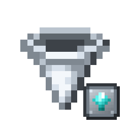
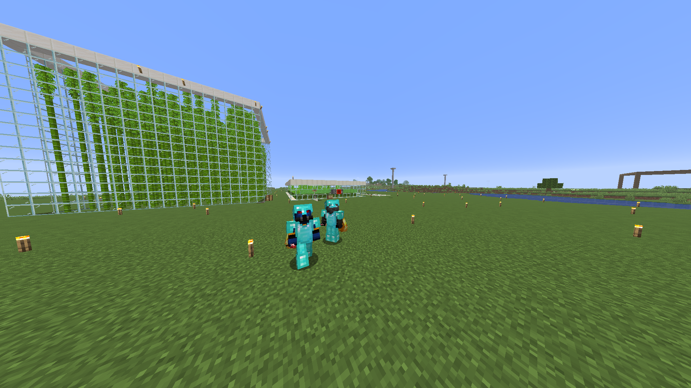
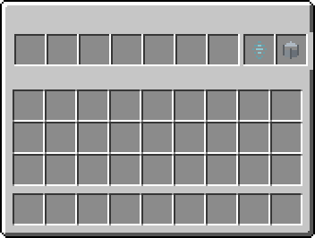

<p align="center">
  
</p>

<h1 align="center">⚡ Reinforced Hopper</h1>

<p align="center">
  <strong>Tolvas reforzadas de alta velocidad, transporte vertical invertido y sistema modular de carriles para Minecraft Fabric 1.21.9.</strong>
</p>

<p align="center">
  <a href="https://github.com/Noel619/reinforced-hopper/releases"></a>
  
  
  
</p>

---

## 🌟 Características Principales

* ⚙️ **7 Ranuras de Inventario:** Más capacidad que la tolva convencional de 5 ranuras.
* ⚡ **2.5x Más Rápida:** Enfriamiento base reducido a solo **3 ticks** (vs. 8 ticks de vainilla).
* 🔄 **Tolva Invertida:** Extrae objetos desde abajo y los bombea hacia arriba sin necesidad de complicados ascensores de ítems.
* 💎 **Ranura de Velocidad x3:** Admite la *Mejora de Velocidad* para reducir el tiempo de enfriamiento a **1 tick (20 ítems/s)**.
* 🎢 **Ranura de Carriles Modulares:** Admite mejoras de carriles para transferir **2, 3 o 4 ítems distintos** al mismo tiempo.
* 🛡️ **Seguridad Total:** Las ranuras de mejora están blindadas contra tolvas externas, tuberías y tolvas de transporte.
* 🔴 **Compatibilidad Redstone:** Comparadores calculan la señal únicamente basándose en los 7 slots de almacenamiento.

---

## 📸 Demostración en el Juego

<p align="center">
  
</p>

---

## 📦 Las Tolvas

| Ítem | Bloque | Descripción |
| :---: | :---: | :--- |
|  | **Tolva Reforzada** | Transporta ítems hacia abajo o hacia los laterales a **2.5x** de velocidad base con 7 ranuras de almacenamiento. |
|  | **Tolva Reforzada Invertida** | Extrae ítems de contenedores ubicados **debajo** y los eleva hacia **arriba** (o laterales). Succiona objetos caídos desde su base. |

---

## 🖥️ Interfaz y Ranuras de Mejora (GUI)

<p align="center">
  
</p>

La interfaz dispone de 9 ranuras organizadas estratégicamente:

1. **Slots 1 a 7 (Izquierda):** Ranuras de almacenamiento estándar para tus ítems.
2. **Slot 8 (Icono Diamante):** Ranura exclusiva para la **Mejora de Velocidad**.
3. **Slot 9 (Icono Tolva):** Ranura exclusiva para las **Mejoras de Carril**.

---

## 🧩 Tarjetas de Mejora

### 1. Mejora de Velocidad
| Icono | Nombre | Efecto |
| :---: | :--- | :--- |
|  | **Mejora de Velocidad Reforzada** | Eleva la velocidad de la tolva a **x3** (1 tick de cooldown = 20 ítems por segundo). |

### 2. Mejoras de Carril
Permiten que la tolva transfiera múltiples tipos de ítems al mismo tiempo por ciclo:

| Icono | Mejora | Carriles | Rendimiento |
| :---: | :--- | :---: | :--- |
|  | **Mejora de Carril de Esmeralda** | **2** | Hasta **2 ítems distintos** transferidos a la vez por ciclo. |
|  | **Mejora de Carril de Diamante** | **3** | Hasta **3 ítems distintos** transferidos a la vez por ciclo. |
|  | **Mejora de Carril de Netherite** | **4** | Hasta **4 ítems distintos** transferidos a la vez por ciclo. |

> [!NOTE]
> **Comportamiento de los carriles:**  
> Si la tolva solo contiene un único tipo de ítem (por ejemplo, únicamente bloques de piedra), viajarán de 1 en 1 normalmente. Los carriles adicionales entran en acción cuando la tolva contiene **ítems variados**, permitiendo que cada tipo de ítem utilice su propio carril sin bloquear a los demás.

---

## 🛠️ Recetas de Crafteo

### Tolva Reforzada Normal (Cuarzo Arriba)
```
[ Bloque de Hierro ] [      Cuarzo      ] [ Bloque de Hierro ]
[ Bloque de Hierro ] [   Tolva Normal   ] [ Bloque de Hierro ]
[                  ] [ Bloque de Hierro ] [                  ]
```

### Tolva Reforzada Invertida (Cuarzo Abajo)
```
[                  ] [ Bloque de Hierro ] [                  ]
[ Bloque de Hierro ] [   Tolva Normal   ] [ Bloque de Hierro ]
[ Bloque de Hierro ] [      Cuarzo      ] [ Bloque de Hierro ]
```

### Mejora de Velocidad Reforzada
```
[ Lingote de Hierro ] [ Lingote de Hierro ] [ Lingote de Hierro ]
[ Lingote de Hierro ] [     Diamante      ] [ Lingote de Hierro ]
[ Lingote de Hierro ] [ Lingote de Hierro ] [ Lingote de Hierro ]
```

### Mejora de Carril de Esmeralda (2 Carriles)
```
[ Lingote de Hierro ] [     Esmeralda     ] [ Lingote de Hierro ]
[     Esmeralda     ] [     Redstone      ] [     Esmeralda     ]
[ Lingote de Hierro ] [     Esmeralda     ] [ Lingote de Hierro ]
```

### Mejora de Carril de Diamante (3 Carriles)
```
[ Lingote de Hierro ] [     Diamante      ] [ Lingote de Hierro ]
[     Diamante      ] [     Redstone      ] [     Diamante      ]
[ Lingote de Hierro ] [     Diamante      ] [ Lingote de Hierro ]
```

### Mejora de Carril de Netherite (4 Carriles)
```
[ Lingote de Hierro ] [ Lingote Netherite ] [ Lingote de Hierro ]
[ Lingote de Hierro ] [     Redstone      ] [ Lingote de Hierro ]
[ Lingote de Hierro ] [ Lingote Netherite ] [ Lingote de Hierro ]
```

---

## 📥 Instalación

1. Instala **Minecraft 1.21.9** con **Fabric Loader**.
2. Asegúrate de incluir **Fabric API**.
3. Descarga la última versión desde [GitHub Releases](https://github.com/Noel619/reinforced-hopper/releases).
4. Coloca el archivo `.jar` en tu carpeta `.minecraft/mods`.
5. ¡Listo para automatizar a máxima velocidad!
